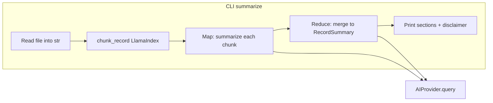

# Medical record summarization (SPEC + LlamaIndex + FR-004)

## Requirements traceability

| Requirement | Implementation angle |
|-------------|---------------------|
| **US2** — structured sections (diagnoses, medications, allergies, follow-ups), chunking for long records | `RecordSummary` model + map–reduce in [`src/services/summarizer.py`](src/services/summarizer.py) |
| **FR-003** — disclaimer on every response | Central `DISCLAIMER` in [`src/cli/output.py`](src/cli/output.py) (full text from SPEC), always set on `RecordSummary` and printed after output |
| **FR-004** — no persist/log/transmit patient data **outside** the active session | In-session LLM calls are allowed (otherwise summarization is impossible). Enforce: no logging record text; no disk writes for chunks or fixtures in service code; no vector store / embedding persistence; avoid CLI flags that write summary or raw record to disk for `summarize` (align with [cli-schema.md](specs/001-healthcare-cli-agent/contracts/cli-schema.md): “No content is written to disk or logs”). |

## Current gap

- Only [`main.py`](main.py) exists at repo root; there is **no** `src/` package, **no** tests, and summarize is a stub that echoes input and supports `--output` (problematic for FR-004 / contract for this subcommand).
- [`pyproject.toml`](pyproject.toml) has `llama-index` but lacks `pydantic`, `rich`, `pytest`, `pytest-mock`, and a console script entry for `agent`.

## Architecture

- **Chunking**: Use LlamaIndex **core text splitting only**—e.g. [`SentenceSplitter`](https://developers.llamaindex.ai/python/framework-api-reference/node_parsers/sentence_splitter/) from `llama_index.core.node_parser` with `chunk_size` aligned to `max_tokens` (implementation detail: map tokenizer semantics to splitter settings at build time). Parse short-lived [`Document`](https://docs.llamaindex.ai/) instances from the record string, call `get_nodes_from_documents` or `split_text`, extract plain-text chunk strings. **Do not** construct `VectorStoreIndex`, `StorageContext`, or any on-disk index ([research.md](specs/001-healthcare-cli-agent/research.md) Decision 4).
- **Map–reduce**: For each chunk, `provider.query(system=..., prompt=chunk_summary_instruction)` returning JSON-compatible partials; final reduce prompt merges partials into one structured object parsed into `RecordSummary`. Single-chunk path skips redundant merge where safe.

## Blocking prerequisites (minimal “foundation” for US2)

User Story 2 in [tasks.md](specs/001-healthcare-cli-agent/tasks.md) assumes Phase 2 exists. For summarize to run end-to-end, implement a **minimal slice** (can mirror T004–T008, T010–T011 but scoped to what summarize needs):

1. **`AIProvider` protocol** + **`ProviderError`** — [`src/providers/base.py`](src/providers/base.py): `query(prompt: str, system: str) -> str`, `name: str`.
2. **Concrete providers** — [`src/providers/claude.py`](src/providers/claude.py), [`gpt.py`](src/providers/gpt.py), [`gemini.py`](src/providers/gemini.py) (anthropic / openai / google-generativeai per plan).
3. **`ProviderFactory.get(name)`** — [`src/providers/__init__.py`](src/providers/__init__.py).
4. **Config default provider** — minimal [`src/config.py`](src/config.py): read default from `~/.config/healthcare-agent/config.toml` or default `claude` so `--provider` + factory work (tasks T036 can stay partial if only summarize is wired first).
5. **Output helpers + Typer app** — [`src/cli/output.py`](src/cli/output.py), [`src/cli/main.py`](src/cli/main.py): register `summarize` with mutual exclusion `--file` / `--input`, optional `--provider`, exit codes per [cli-schema.md](specs/001-healthcare-cli-agent/contracts/cli-schema.md) (1 invalid args, 2 file missing/unreadable, 3 provider error, 4 user abort if you add confirmation—only if spec demands it for summarize; US2 does not require confirmation for display).

**CLI stack**: Repository and [`plan.md`](specs/001-healthcare-cli-agent/plan.md) use **Typer**; [tasks.md](specs/001-healthcare-cli-agent/tasks.md) mentions Click—follow **Typer** and `typer.testing.CliRunner` for contract tests.

**Entry point**: Add `[project.scripts] agent = "src.cli.main:main"` (or equivalent callable) in [`pyproject.toml`](pyproject.toml); configure `[tool.setuptools.packages]` / `[build-system]` so `uv sync` installs the package (may need `packages = ["src"]` or flat layout—pick one standard layout and keep imports consistent).

**Migrate stub**: Retire or thin root [`main.py`](main.py) to re-export / delegate to `src.cli.main` for backwards compatibility, or document `uv run agent` as the supported entry—your choice during implementation; avoid duplicate diverging CLIs.

## User Story 2 deliverables (T021–T027)

1. **[`src/models/records.py`](src/models/records.py)** — `MedicalRecord`, `RecordSummary` (Pydantic) per [data-model.md](specs/001-healthcare-cli-agent/data-model.md).
2. **[`src/services/summarizer.py`](src/services/summarizer.py)** — `chunk_record(text, max_tokens=3000) -> list[str]`; `summarize_record(record, provider) -> RecordSummary`.
3. **`summarize` subcommand** — Read file with UTF-8; on `UnicodeDecodeError` or missing file → exit 2 and clear message (SPEC edge case: binary/non-text). Do **not** log file path + content together at INFO (avoid accidental PHI in logs).
4. **Tests** — [`tests/unit/test_summarizer.py`](tests/unit/test_summarizer.py), [`tests/contract/test_cli_contract.py`](tests/contract/test_cli_contract.py), [`tests/integration/test_no_data_leakage.py`](tests/integration/test_no_data_leakage.py): stub provider with deterministic JSON; assert section labels and disclaimer; integration test captures logs and asserts fixture patient strings never appear in log records (T027).
5. **Fixture** — [`tests/fixtures/sample_record.txt`](tests/fixtures/sample_record.txt) for manual/checkpoint runs.

## FR-004 checklist (concrete)

- No `VectorStoreIndex` / disk cache / embedding store for records.
- Summarizer never writes chunk files; chunk lists stay in memory for the call stack only.
- Do not add `--output` on `summarize` for patient-derived summaries (remove parity with current root [`main.py`](main.py) for this command).
- Structured logging: either avoid logging record/chunk text entirely in this path, or use a test/assertion-friendly pattern so integration tests prove no leakage (T027).
- LLM API calls transmit chunk text **during** the CLI process—acceptable under FR-004; do not add telemetry hooks that send patient text to third parties beyond the chosen provider.

## Dependencies to add

- **Runtime**: `pydantic`, `rich` (per plan output helpers).
- **Dev**: `pytest`, `pytest-mock`.
- Keep `llama-index` as-is; use **core** parsers only.

## Verification

- `uv run pytest tests/unit/test_summarizer.py tests/contract/test_cli_contract.py tests/integration/test_no_data_leakage.py`
- Manual: `uv run agent summarize --file tests/fixtures/sample_record.txt` shows Diagnoses / Medications / Allergies / Follow-up + disclaimer; no patient text in captured logs during tests.
