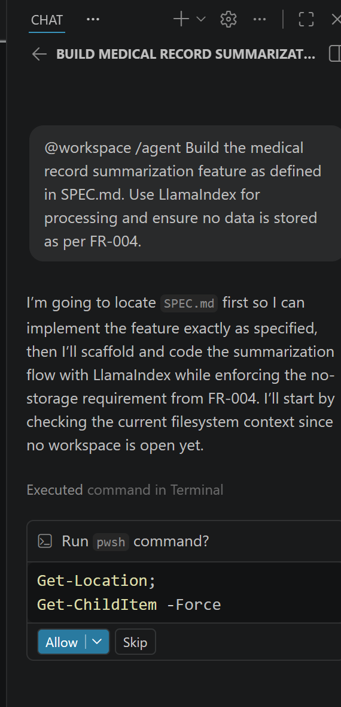
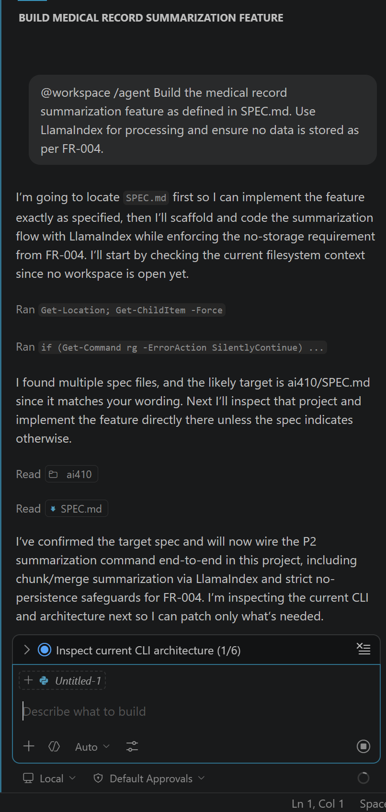
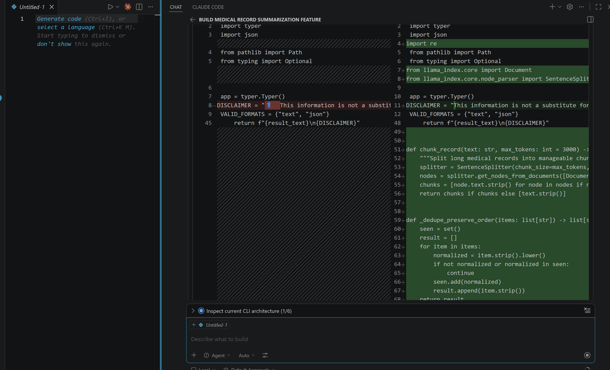
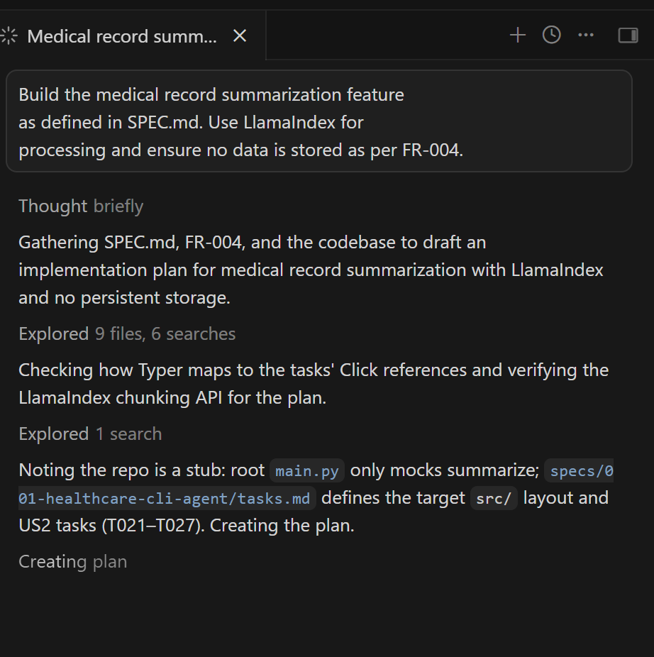
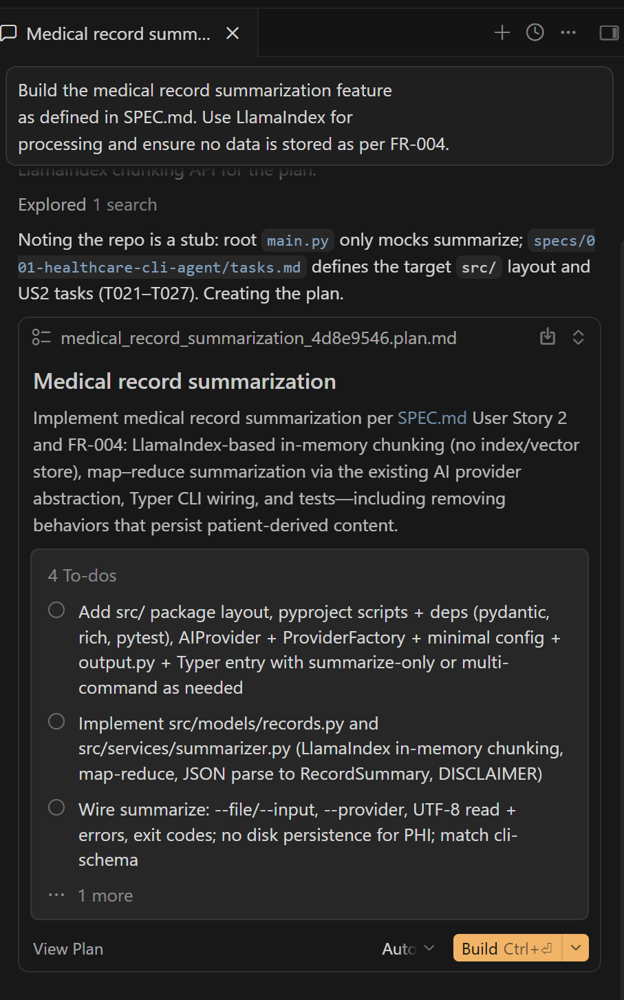
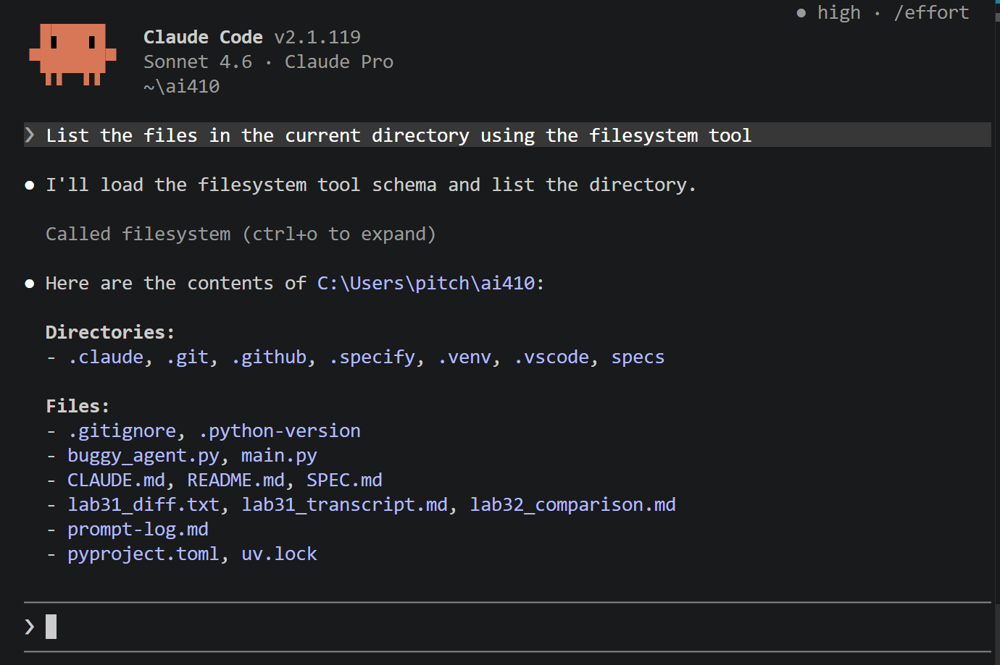
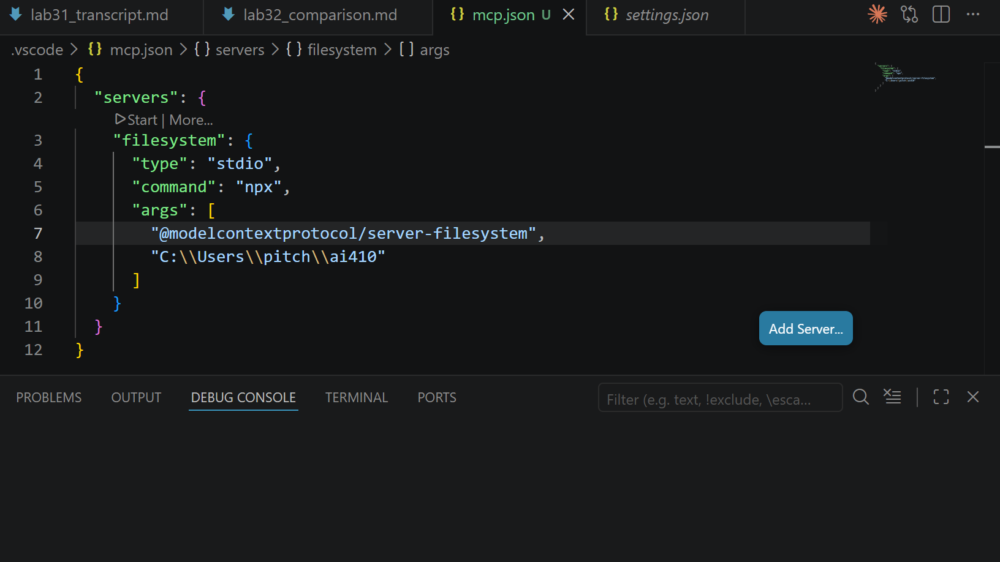

## 1. Purpose

The purpose of this memo is to compare frontier AI models and development workflows in order to identify the most effective strategy for Sprint 2. This analysis focuses on evaluating model capabilities, performance tradeoffs, and tool workflows to support the development of a multi-model comparison system.

## 2. Frontier Model Comparison

The following comparison evaluates four frontier AI models across five key dimensions: context window, reasoning quality, latency, cost, and safety behavior. The analysis is based on course materials and benchmark references.

| Model | Context | Reasoning | Latency | Cost | Safety |
|------|--------|----------|--------|------|--------|
| Claude Sonnet 4.6 | ~1M tokens | Strong coding performance; SWE-bench ~80.8%; MCP-native | Medium | Medium | Confirmation gates; HITL controls; policy-aligned refusals |
| GPT-5.4 | ~1M tokens; 128K output | Strong general reasoning; integrated reasoning mode | Fast | High | Strong content filtering; OpenAI policy alignment |
| Gemini 3.1 Pro | ~1M tokens | Strong long-context and retrieval; 77.1% ARC-AGI-2; 94.3% GPQA | Medium | Medium | Google safety filters; grounding checks |
| o3 | Standard context | Dedicated reasoning for math, science, and coding | Slow | High | Strong alignment; high deliberation quality |

The comparison shows that GPT-5.4 provides strong reasoning performance and fast response times, making it suitable for general-purpose and reasoning-heavy tasks. However, it has higher cost, which may limit scalability.

Claude Sonnet 4.6 offers a balanced performance with strong coding quality and reliable tool usage. Its MCP-native capabilities and safety features make it well-suited for agent-based workflows.

Gemini 3.1 Pro excels in handling long-context inputs and retrieval-based tasks, supported by strong benchmark results. However, its reasoning consistency may vary compared to GPT-5.4.

In contrast, o3 is optimized for deep reasoning tasks such as mathematics and scientific problem-solving. While it delivers high-quality reasoning, it has higher latency and cost, making it less suitable for real-time applications.

Overall, each model presents tradeoffs between reasoning quality, speed, and cost. Claude Sonnet 4.6 stands out as a balanced option, GPT-5.4 is strong for general reasoning tasks, and o3 is best suited for specialized complex problem-solving.

"Note: Latency and cost are based on published documentation. Empirical measurement will be conducted in Week 4 benchmarking."


## 3. IDE Agent Workflow Comparison

Both tools were given the same prompt:

"Build the medical record summarization feature as defined in SPEC.md. Use LlamaIndex for processing and ensure no data is stored as per FR-004."

### Evidence Summary

**VSCode Agent Mode:**
The agent began by locating and reading SPEC.md to understand the requirements. It explored the project structure and requested permission to access external files. The agent executed terminal commands (e.g., listing directories and files) to inspect the workspace.

It then proceeded with implementation by modifying existing files, adding LlamaIndex-related imports, and integrating summarization logic while respecting the no-data-storage requirement. The agent also performed step-by-step verification, allowing the user to approve or skip actions.


*Figure 1: Prompt sent to VSCode Copilot Agent*


*Figure 2: Agent confirmed SPEC.md as target*


*Figure 3: Agent added LlamaIndex imports*

**Cursor Composer (Plan Mode):**
Cursor Composer focused on planning rather than execution. It explored multiple project files and performed web searches (e.g., LlamaIndex documentation) to understand the feature requirements.

It generated a structured plan, including proposed file organization (such as separating logic into modules like summarizer.py), but did not execute terminal commands or directly modify code in Plan Mode.

### Evidence Summary (Cursor Composer)

Prompt used:
"Build the medical record summarization feature as defined in SPEC.md. Use LlamaIndex for processing and ensure no data is stored as per FR-004."

Observed behavior:
Cursor Composer focused on planning rather than direct implementation. It explored project files such as SPEC.md and tasks.md, identified that the repository was a stub, and analyzed the required feature scope.

The agent also performed web searches to understand LlamaIndex APIs and relevant implementation patterns. It generated a structured development plan, including a proposed project layout (e.g., src/models, src/services) and a list of actionable tasks.

The plan included multiple steps such as setting up the package structure, implementing summarization logic, and wiring CLI commands. However, Cursor Composer did not execute terminal commands or directly modify code in Plan Mode.


*Figure 4: Cursor exploring 9 files*


*Figure 5: Cursor generated plan document*

### Comparison

| Criteria     | VSCode Copilot Agent                                            | Cursor Composer (Plan Mode)                               |
| ------------ | --------------------------------------------------------------- | --------------------------------------------------------- |
| Planning     | Reads project files and plans implicitly during execution       | Generates explicit structured plans before implementation |
| Edit Quality | Direct file edits with clean, incremental changes               | Proposes multi-file architecture but does not implement   |
| Verification | Executes terminal commands and supports step-by-step validation | No execution or validation in Plan Mode                   |
| Model Used   | Auto (Copilot default)                                          | Auto (Cursor agent panel)                                 |
| Best For     | Controlled, step-by-step implementation                         | High-level planning and system design                     |

### Analysis

The comparison shows that VSCode Agent Mode is more effective for step-by-step implementation and verification. It directly interacts with the codebase, executes terminal commands, and enables incremental validation, making it suitable for controlled development workflows where correctness is important.

In contrast, Cursor Composer emphasizes upfront planning. It explores both local files and external documentation to generate a structured development plan. However, in Plan Mode, it does not execute or verify code, which requires additional manual steps before implementation.

Overall, VSCode Agent Mode is better suited for precise coding and verification tasks, while Cursor Composer is more useful for high-level planning and structuring complex features.

## 4. MCP Integration Notes

### Setup Steps

**Claude Code (CLI):**
A local filesystem MCP server was added using:

```bash
claude mcp add filesystem -- npx @modelcontextprotocol/server-filesystem C:\Users\pitch\ai410
```

**VSCode Copilot (IDE):**
The MCP server was configured via a `.vscode/mcp.json` file:

```json
{
  "servers": {
    "filesystem": {
      "type": "stdio",
      "command": "npx",
      "args": [
        "@modelcontextprotocol/server-filesystem",
        "C:\\Users\\pitch\\ai410"
      ]
    }
  }
}
```

### Successful Tool Call Evidence

A successful MCP tool call was observed when the agent used the filesystem tool to list files in the current directory. This confirmed that the agent could interact with the local project environment through MCP rather than only responding in chat.

Example tool call:
`mcp__filesystem__list_directory`



*Figure 6: Claude Code CLI MCP tool call*


*Figure 7: VSCode MCP tool call*

### Observed Limitation

One limitation of the MCP setup is the need for manual permission approvals before the agent can access files or execute commands. While this improves safety, it can slow down the workflow.

Additionally, MCP functionality depends on correct workspace configuration. If the wrong directory is selected, the agent may not access the intended files.

## 5. Sprint 2 Model Strategy

### Recommendation: Claude Sonnet 4.6 as Primary

Claude Sonnet 4.6 is selected as the primary model for Sprint 2 based on its strong performance in coding tasks and reliable agent workflow support. It achieves a high SWE-bench Verified score (~80.8%) and provides balanced reasoning capability with efficient latency. In addition, its compatibility with MCP-based tool usage makes it well-suited for agent-driven development workflows.

### Model Allocation by Feature

| Feature              | Model             | Rationale                                                                 |
| -------------------- | ----------------- | ------------------------------------------------------------------------- |
| Symptom checking     | Claude Sonnet 4.6 | Fast, accurate, and supports MCP-enabled agent workflows                  |
| Record summarization | Claude Sonnet 4.6 | Works well with LlamaIndex chunking and enforces FR-004 no-storage policy |
| Drug interactions    | Claude Opus 4.6   | Higher reasoning capability for safety-critical decisions                 |
| Provider fallback    | GPT-5.4           | Stable baseline model when Claude is unavailable (FR-002, FR-012)         |
| Medical knowledge    | Gemini 3.1 Pro    | Strong performance on scientific and retrieval-oriented queries           |

### Validation Plan

Claude Opus 4.6 is provisionally selected for drug interaction analysis due to its higher reasoning capability. A direct comparison between Opus 4.6 and Sonnet 4.6 will be conducted during Week 4 benchmarking to validate performance tradeoffs.

### Summary

The comparison demonstrates that VSCode Agent Mode and Cursor Composer provide complementary capabilities. VSCode Agent Mode is more effective for controlled, step-by-step implementation with integrated verification, while Cursor Composer is better suited for structured planning and early-stage design.

MCP integration was successfully demonstrated in both CLI and IDE environments, enabling agents to interact with local files through tool calls such as `mcp__filesystem__list_directory`. While setup is straightforward, permission controls introduce minor workflow overhead.

Overall, Claude Sonnet 4.6 is recommended as the primary model for Sprint 2 due to its strong coding performance, reliable tool use, and alignment with MCP-based agent workflows. Supporting models, including GPT-5.4 and Gemini 3.1 Pro, will be used for benchmarking and specialized tasks, ensuring a balanced and robust multi-model strategy.


## References

1. Anthropic. *Claude Sonnet 4.6 / Opus 4.6 Model Card*. Anthropic, 2026.
2. OpenAI. *GPT-5 System Documentation*. OpenAI, 2026.
3. Google DeepMind. *Gemini 3.1 Pro Technical Report*. Google, 2026.
4. OpenAI. *o3 Technical Report*. OpenAI, 2026.
5. AI410 Spring 2026. *Week 3 Readings and Model Comparison Resources*. Bellevue College, 2026.
